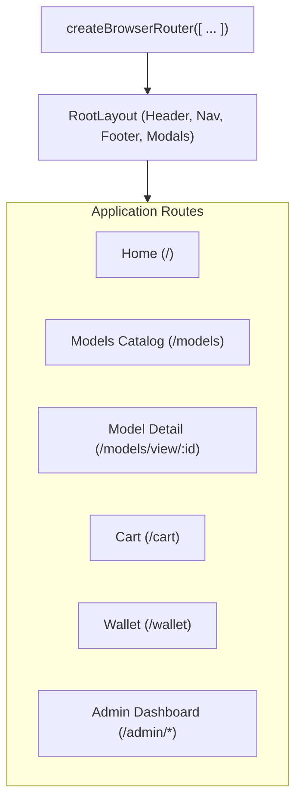
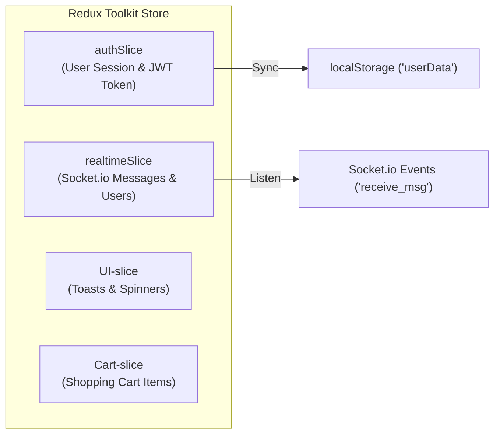
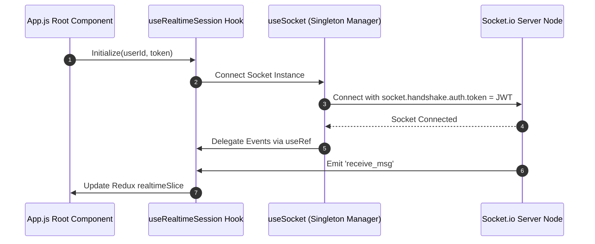

# 01 — Frontend Architecture & State Management

> **Repository**: [`modelLink_client`](../README.md)  
> **Framework**: React 18, React Router v6 Data API (`createBrowserRouter`), Redux Toolkit

---

## 1.1 Routing Architecture (React Router v6 Data API)

**Implementation**: [`src/App.js`](../src/App.js)

The application utilizes `createBrowserRouter` (Data API variant) enabling pre-render data fetching (`loader`), form mutation actions (`action`), and per-route error boundaries (`errorElement: <RouteErrorBoundary />`).

---

## 1.2 Redux Toolkit Store & Slice Architecture

**Implementation**: [`src/store/index.js`](../src/store/index.js)

### 4 Store Slices

1. **`authSlice`** (`src/store/authSlice.js`): Stores user session data (`userData`). Automatically synchronizes state to `localStorage.userData`.
2. **`realtimeSlice`** (`src/store/realtimeSlice.js`): Manages real-time data from WebSockets: active conversations array (`chats`), unread notification count, online users list (`onlineUsers`).
3. **`UI-slice`** (`src/store/UI-slice.js`): Controls global toast notifications (`notification`) and loading spinner state.
4. **`Cart-slice`** (`src/store/Cart-slice.js`): Shopping cart items and price calculation.

---

## 1.3 Real-Time Hook Composition (`useSocket` & `useRealtimeSession`)

### Ref-Based Event Delegation Pattern

In [`src/hooks/useSocket.js`](../src/hooks/useSocket.js), event handlers are stored in a `useRef` (`handlersRef.current = handlers`). Socket listeners call `handlersRef.current[eventName]()`, allowing dynamic React state updates without re-binding Socket.io event listeners on every render.
